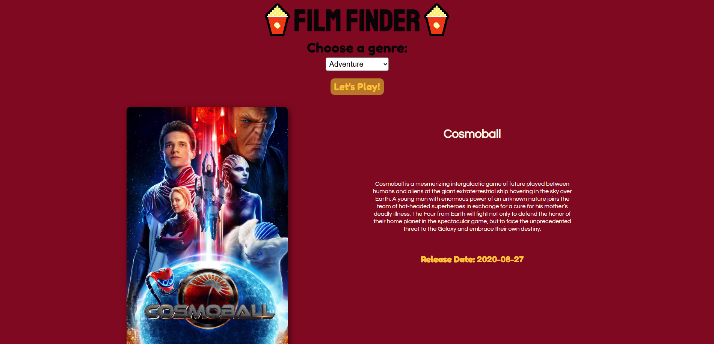

<h1 align="center"> Film Finder </h1>

Um app feito para estudos de API, onde você pode procurar filmes pelo gênero.   

  <a href="#-tecnologias">Tecnologias</a>&nbsp;&nbsp;&nbsp;|&nbsp;&nbsp;&nbsp;
  <a href="#-projeto">Projeto</a>&nbsp;&nbsp;&nbsp;|&nbsp;&nbsp;&nbsp;
  <a href="#-layout">Layout</a>&nbsp;&nbsp;&nbsp;|&nbsp;&nbsp;&nbsp;
  <a href="#memo-licença">Licença</a>

  

 

  

## 🚀 Tecnologias

Esse projeto foi desenvolvido com as seguintes tecnologias:

- HTML e CSS
- JavaScript

## 💻 Projeto

O Film Finder irá te ajudar a encontrar os melhores filmes sendo um projeto de estudo sobre o uso de API's com o Javascript

- [Acesse o projeto finalizado, online](https://devlusket.github.io/projetoFilmFinder/)
